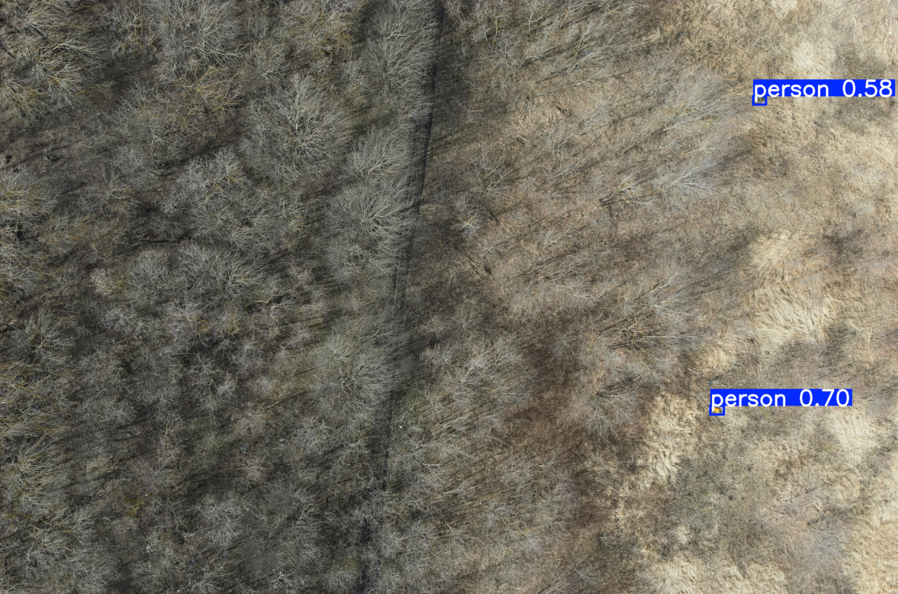
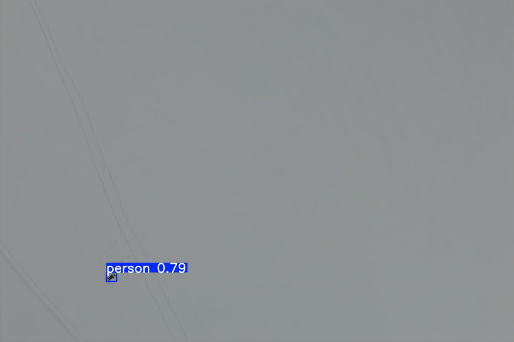
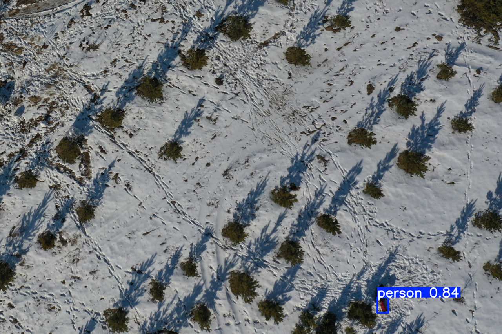

# Archipelago-2025-4ebupelki-team

## Описание проекта
Этот репозиторий содержит решение команды **4ebupelki** для соревнования **Архипелаг 2025. Обработка датасетов, полученных с БАС, с помощью нейронных сетей**.  
В нём представлены наборы данных, обученные модели, скрипты для инференса и результаты работы алгоритмов детектирования объектов (YOLO).

**Задача соревнования:**
<br>Разработать решение, предназначенное для автоматического распознавания объектов (людей) на изображениях, полученных с БВС. Решение должно в автоматическом режиме получать на вход изображения, проводить распознавание объектов и выдавать на выход описание местоположения объектов на изображениях.</br>
Итогом выполнения задачи должна быть обученная нейросеть, которая с заданной точностью обнаруживает людей в сложных природных условиях на снятых с беспилотного воздушного судна снимках.

В рамках реализации задачи, была обучена модель YOLOv8s на основе 10 тысячи пар image-label и 100 эпохах. А затем дообучена: сначала на 10 тысячах пар, а потом на 1 тысяче. В результата модель имеет следующие метрики:

| Метрика       | Train (финальное) | Val (финальное) |
|---------------|-------------------|-----------------|
| Box Loss      | 1.287             | 1.681           |
| Class Loss    | 0.519             | 0.795           |
| mAP50         | -                 | 0.931           |
| mAP50-95      | -                 | 0.570           |
| Precision     | -                 | 0.937           |
| Recall        | -                 | 0.883           |

---

## Пример детекции

<p>
   
   
   
</p>

---
## Структура проекта

```
.
├── .ipynb_checkpoints/           # Контрольные точки Jupyter Notebook
├── dataset/
│   └── labels/                   # Аннотации для набора данных
├── dataset_additional_training/
│   └── labels/                   # Аннотации для дообучения
├── runs/
│   └── detect/                   # Результаты обнаружения (YOLO)
├── solution/                     # Код решения или скрипты инференса
├── .gitattributes                # Настройки атрибутов Git
├── data.yaml                     # Конфигурация набора данных
├── human_rescue.ipynb            # Jupyter Notebook с анализом/обработкой
├── model.pt                      # Основная обученная модель (PyTorch)
└── yolo11n.pt                    # Дополнительная модель YOLO
```

---

## Установка

1. Клонируйте репозиторий:
   ```bash
   git clone https://github.com/qum11ch/Archipelago-2025-4ebupelki-team-.git
   cd Archipelago-2025-4ebupelki-team-
   ```

2. Установите зависимости:
   ```bash
   pip install -r requirements.txt
   ```

---

## Использование

1. Запуск Jupyter Notebook:
   ```bash
   jupyter notebook human_rescue.ipynb
   ```

2. Для инференса с моделью YOLO:
   ```python
   from ultralytics import YOLO

   model = YOLO("model.pt")
   results = model("path/to/image.jpg")
   results.show()
   ```

3. Папки проекта:
   - **dataset/** — основной набор данных с аннотациями.
   - **dataset_additional_training/** — набор данных для дообучения.
   - **runs/detect/** — сохранённые результаты детектирования.
   - **solution/** — готовые скрипты решения.

---

## Контрибуция
Если хотите внести изменения:
1. Создайте новую ветку:
   ```bash
   git checkout -b feature-name
   ```
2. Внесите правки и закоммитьте:
   ```bash
   git commit -m "Описание изменений"
   ```
3. Создайте Pull Request.

---

